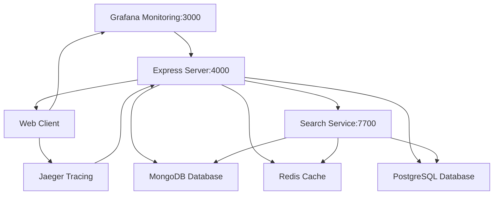

# Minikube network graph

```mermaid
graph TD;
  grafana["Grafana Monitoring"] --> express["Express Server"];
  jaeger["Jaeger Tracing"] --> express["Express Server"];
  express["Express Server"] --> web-client["Web Client"];
  express["Express Server"] --> search["Search Service"];
  express["Express Server"] --> mongodb["MongoDB Database"];
  express["Express Server"] --> redis["Redis Cache"];
  express["Express Server:4000"] --> postgres["PostgreSQL Database"];
  web-client["Web Client"] --> grafana["Grafana Monitoring:3000"];
  web-client["Web Client"] --> jaeger["Jaeger Tracing"];
  search["Search Service"] --> mongodb["MongoDB Database"];
  search["Search Service"] --> redis["Redis Cache"];
  search["Search Service:7700"] --> postgres["PostgreSQL Database"];
```