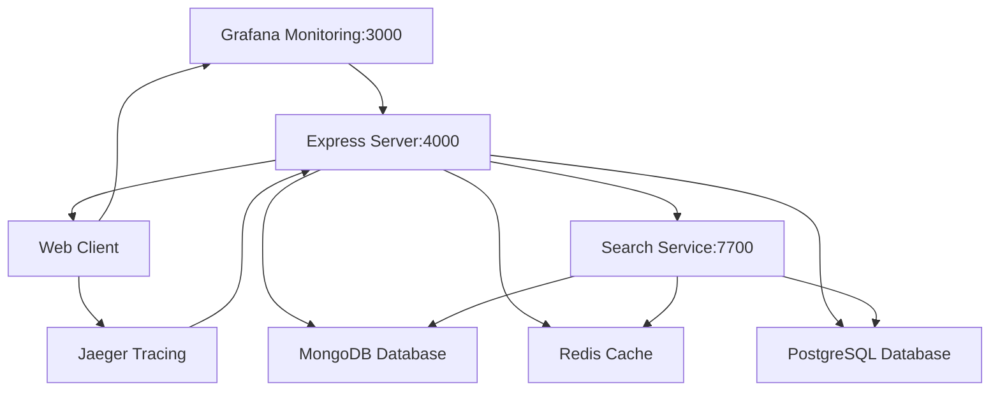

# Minikube local environment

## terraform.tfvars is generated — never commit it

`tfvars.sh` writes `terraform.tfvars` from the environment file every time
`bin/terraform.sh` runs, so the file is a build artifact containing live
credentials. It is gitignored, and it was previously committed by mistake.

Set these in `config/<config>/.env.<env>`; `tfvars.sh` maps them onto the
Terraform variables:

| Environment variable | Terraform variable |
|---|---|
| `REACTORY_HOME`, `REACTORY_SERVER` | `reactory_home`, `reactory_server_root`, `reactory_server_modules_root` |
| `MONGO_DB`, `MONGO_USER`, `MONGO_PASSWORD`, `MONGO_PORT` | `reactory_mongo_*` |
| `REACTORY_POSTGRES_DB`, `_USER`, `_PASSWORD`, `_HOST`, `_PORT` | `reactory_postgres_*` |
| `REACTORY_REDIS_PASSWORD` | `reactory_redis_password` |
| `MEILISEARCH_MASTER_KEY` | `reactory_meilisearch_master_key` |
| `REACTORY_GRAFANA_PASSWORD` | `reactory_grafana_admin_password` |

`terraform.tfstate` is local state and is also gitignored — it held the same
credentials.

## Network graph

